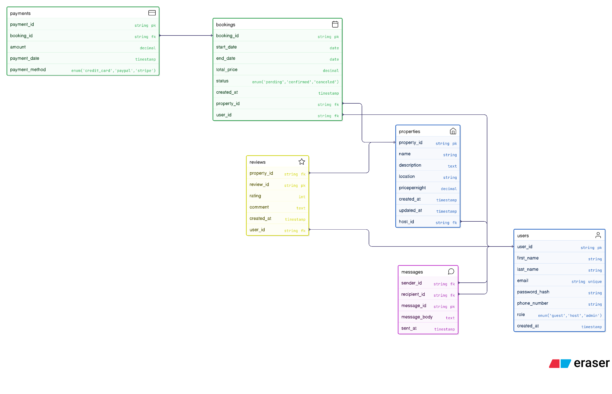

# Task 0: ERD Diagram for the Airbnb Clone Database

The following Entity-Relationship Diagram (ERD) illustrates the database design for the Airbnb Clone project.  
It defines the entities, attributes, and relationships between core components such as **Users, Properties, Bookings, Payments, Reviews, and Messages**.

## Entities
- **Users**: Represents guests, hosts, and admins.
- **Properties**: Listings created by hosts.
- **Bookings**: Reservations made by guests for properties.
- **Payments**: Transactions linked to bookings.
- **Reviews**: Guest feedback for properties.
- **Messages**: Communication between users.

## Relationships
- A **User (host)** can create many **Properties**.
- A **User (guest)** can make many **Bookings**.
- A **Booking** belongs to one **Property** and one **User**.
- A **Payment** belongs to a **Booking**.
- A **User** can leave a **Review** for a **Property**.
- **Users** can send **Messages** to each other.

---
